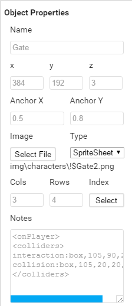
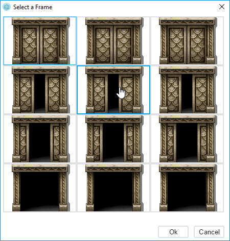

# Links

[Webpage](https://quxios.github.io/#/)

[QMap Plugin](https://quxios.github.io/#/plugins/QMap)

[Github Repo](https://github.com/quxios/QMapEditor)

[RPGMakerWebs thread](https://forums.rpgmakerweb.com/index.php?threads/qplugins-latest-qimport.73023/)

# Controls
* Move `Map Objects` around in the `Map Objects panel` by drag-n-drop
* Pan `Map` by holding down middle mouse button or right mouse button
* Select `Map Object` by left clicking it in the `Map Objects panel` or by clicking its image on the `Map`
* Move` Map Object` by drag-n-drop or with the arrow keys. Disable grid snapping when dragging by holding down Alt
* Inc or Dec input field values with scroll wheel
* Zoom `Map` in/out with scroll wheel
* Lock a `Map Object` by clicking on the lock icon next to it's name in the `Map Objects panel`
* Hide a `Map Object` by clicking on the eye icon next to it's name in the `Map Objects panel`. This will only hide it in the editor, not in game!

# Instructions
## Step 1: Load project
Click on load and load your RPG Maker MV project. It will load in the file `data/QMap.json` if the file is not found it will be created.

## Step 2: Select map
In the `Map List panel`, you will have a list of your project maps. Select the one
you want to work on. When a map is selected the map will be shown in the editor
and the `Map Objects panel` will be opened next to the `Map List panel`.

## Step 3: Creating a Map Object
To create a new `Map Object` click on the `+New` button at the bottom of the `Map
Objects panel`.

## Step 4: Editing a Map Object
Select the `Map Object` you want to edit. Either click on it in the `Map Objects
panel` or click on it map if it already has a image attached. Once a `Map Object`
is selected you will see the `Object Properties panel`

### Name
The name of the `Map Object`.

### X
The x position of the `Map Object`.

### Y
The y position of the `Map Object`. Used for sorting `Map Objects`. Larger
Z values appear above. If Z values are the same when sorting, then it will
compare the Y values. Larger Y values will appear above.

### Z
The z position of the `Map Object`. Used for sorting `Map Objects`. Larger
Z values appear above. If Z values are the same when sorting, then it will
compare the Y values. Larger Y values will appear above.

RPG Maker MV Z values
* **0** : Lower tiles
* **1** : Lower characters
* **3** : Normal characters
* **4** : Upper tiles
* **5** : Upper characters
* **6** : Airship shadow
* **7** : Balloon
* **8** : Animation
* **9** : Destination

### Scale X / Y
The scaling of the sprite. Does not affect the data layer, only the sprite image.

### Angle
The angle (in degrees) to rotate the sprite. Does not affect the data layer, only the sprite image.

### Anchor X / Y
The anchor position on for the sprite. The anchor is shown on the `Map Object`
with a red dot.

### Image
The image this `Map Object` will use.

### Type
* **Full** : Will use the full image
* **SpriteSheet** : Will use only a slice from the image
* **Animated** : Will animate the sprite sheet from top left slice to bottom right.

### Cols / Rows
Only shown when type is `SpriteSheet` or `Animated`

Use this to set the number of columns and rows the sprite has.

### Index
Only shown when type is `SpriteSheet`

Click on it to open an index select window. Use that window to select which
frame you want the `Map Object` to use.

### Speed
Only shown when type is `Animated`

The wait time between the frames. 60 frames is 1 second.

### Conditions
Select the condition for the Map Object to appear. If no conditions are set the
`Map Object` will always be visible. If any condition in the condition list return
false the `Map Object` will not be visible.

### Notes
You can add certain note tags here to add "effects" to the map object. The
available tags can be found in the plugins header or at the [Plugin Page](https://quxios.github.io/#/plugins/QMap/qmap-editor-notes)
